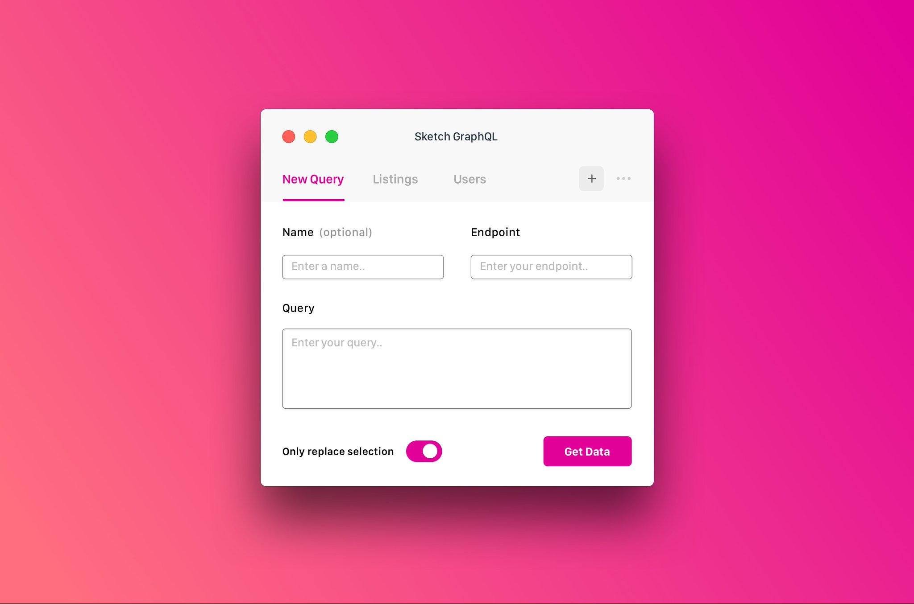

# sketch-gql

## Use graphql data in your designs 💅🏻 ##



### Using the plugin

The package builder automatically will update your sketch plugins folder :)

### Getting started

``` bash
# build with hot reload
npm run watch

# build for production
npm run build
```

### Debugging

To view the output of your `console.log`, you have a few different options:
* Open `Console.app` and look for the sketch logs
* Use Safari's web inspector to debug your plugin's javascript context
* Look at the `~/Library/Logs/com.bohemiancoding.sketch3/Plugin Output.log` file

You can also

```bash
skpm log
```

The `-f` option causes `skpm log` to not stop when the end of logs is reached, but rather to wait for additional data to be appended to the input

